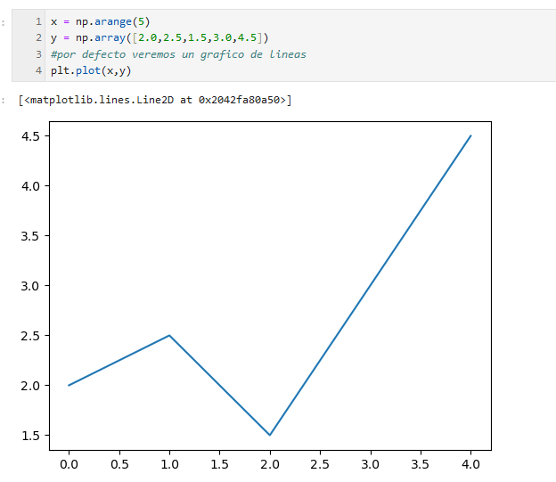

# Visualización de datos

La visualizacion de datos es basicamente volcar los datos a gráficos, Las graficas y la visulizacion facilitan en gran medida la lectura de datos.
Debemos tener tambien en cuenta la calidad del gráfico y la utilización del 

Algunas de las librerías mas utilizadas en la visualización de datos son:

- Matplotlib
- Seaborn
- Bokeh
- Altair

Para generar un grafico las primeras pruebas comenzaremos empleando matplotlib.
En este tipo de graficos necesitaremos rellenar los valores que van en el Eje X
y los valores que van en el eje Y.
Por defecto en matplotlib si no establecemos que se use otra figura,
se usaran las lineas

